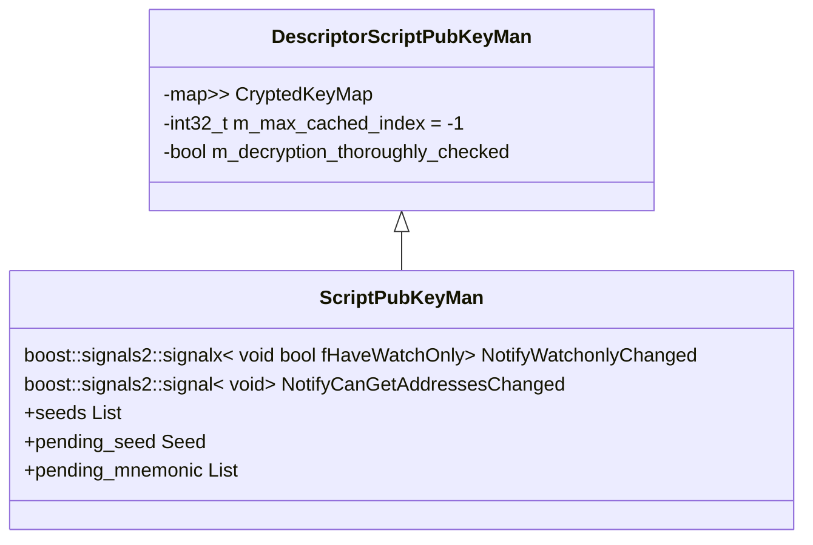
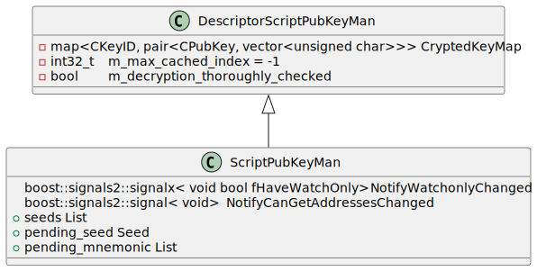

# README

## Sample class diagram using mermaid

You can generate the diagram using this code:
```shell
    classDiagram
        DescriptorScriptPubKeyMan <|-- ScriptPubKeyMan
    class ScriptPubKeyMan {
        boost::signals2::signalx< void bool fHaveWatchOnly> 	NotifyWatchonlyChanged
        boost::signals2::signal< void> 	N:whiteotifyCanGetAddressesChanged
        +seeds List
        +pending_seed Seed
        +pending_mnemonic List
    }
    class DescriptorScriptPubKeyMan {
        -map<CKeyID, pair<CPubKey, vector<unsigned char>>> CryptedKeyMap
        -int32_t 	m_max_cached_index = -1
        -bool 	m_decryption_thoroughly_checked
    }
```

Advantages:
* Works naively on github, so is easier to integrate on md pages
* Ideal for simple diagrams

Disadvantages:
* Doesn't support special characters, specially for some types in c++ like when using `<<` symbols, as you can see in this example for the `map<CKeyID, pair<CPubKey, vector<unsigned char>>> CryptedKeyMap` attribute



----------------------------

## Sample class diagram using plantuml


You have to generate the SVG diagram with a command line tool, you can install the tool with a package manager like brew on mac

```shell
> plantuml example.plantuml

```

Generates the file Example.svg

Source code of example.plantuml
```shell
@startuml Example
    class DescriptorScriptPubKeyMan <|-- ScriptPubKeyMan
    class ScriptPubKeyMan {
        boost::signals2::signalx< void bool fHaveWatchOnly> 	NotifyWatchonlyChanged
        boost::signals2::signal< void> 	NotifyCanGetAddressesChanged
        +seeds List
        +pending_seed Seed
        +pending_mnemonic List
    }
    class DescriptorScriptPubKeyMan {
        -map<CKeyID, pair<CPubKey, vector<unsigned char>>> CryptedKeyMap
        -int32_t 	m_max_cached_index = -1
        -bool 	m_decryption_thoroughly_checked
    }
@enduml
```
Display the Example.svg image




Advantages:
* You can use special symbols and works particullary well with C++ types
* More options to make diagram more detailed/richer
* Flexible to group items and change arrow directions

Disadvantages:
* Doesn't work nativelly on Github, you have to generate the svg diagrams using a command line tool and include them as images in your md files

